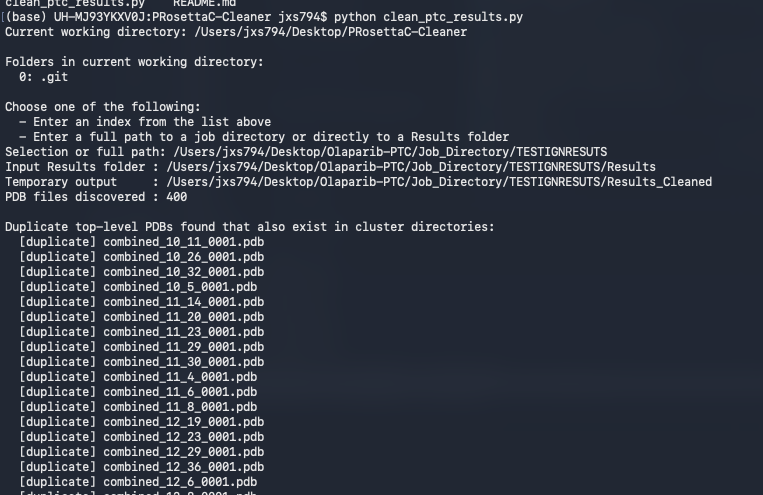
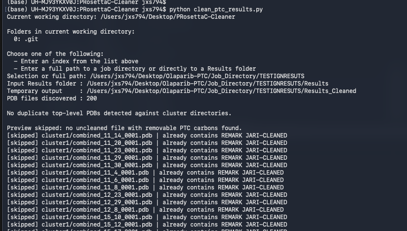
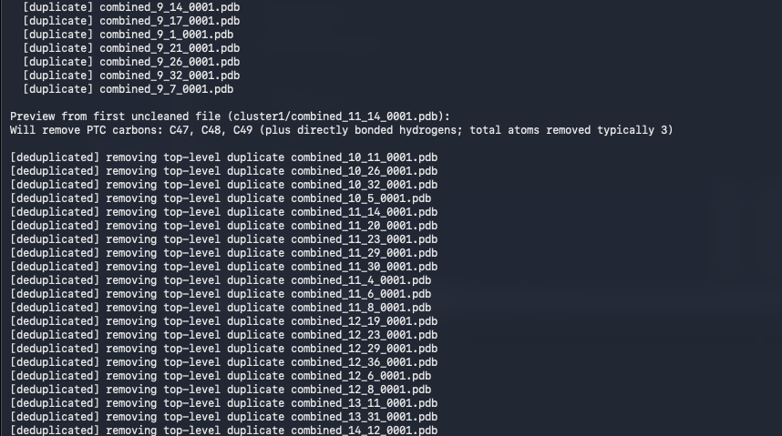
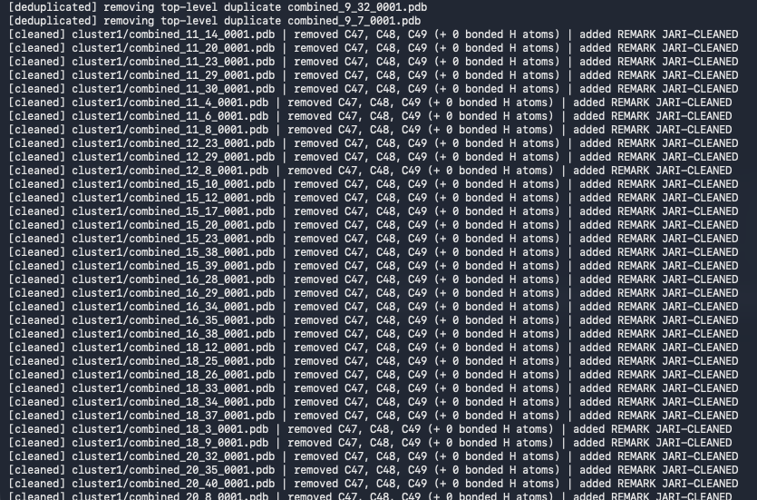

# 🔬 PRosettaC-Cleaner

> A workflow-specific post-processing utility for **PRosettaC** output folders generated on **Pegasus2 / IDSC**.

---

## 🤝 Need Help with PRosettaC?

If you are working on a **PRosettaC** or broader **PROTAC modeling** project and need help with:

- setting up or troubleshooting a PRosettaC run
- cleaning and interpreting PRosettaC outputs
- workflow design for PROTAC ternary-complex modeling
- collaborations related to PRosettaC, PROTACs, or ternary-complex analysis

you are welcome to reach out.

[](mailto:jmschulz@med.miami.edu?subject=PRosettaC%20Help%20%2F%20Collaboration)

---

## 📚 Bibliography / Related Resources

This repository is part of a broader research and workflow effort around **PROTAC ternary-complex modeling**, **PRosettaC post-processing**, and downstream structural analysis.

[](https://pubmed.ncbi.nlm.nih.gov/41152377/)
[](mailto:jmschulz@med.miami.edu?subject=PRosettaC%20Cleaner%20Question)
[](mailto:jmschulz@med.miami.edu?subject=Need%20Help%20with%20PRosettaC)

### 📄 Related paper

**PRosettaC outperforms AlphaFold3 for modeling PROTAC ternary complexes**  
*Scientific Reports* (2025)  
DOI: `10.1038/s41598-025-21502-8`

This cleanup repository is intended to support practical downstream handling of PRosettaC outputs generated during that broader modeling and benchmarking workflow.

---

## 🚀 Overview

`PRosettaC-Cleaner` provides **two ways** to run the same cleanup workflow:

- **Python version** → `clean_ptc_results.py`
- **Bash version** → `clean_ptc_results.sh`

Both scripts are designed to clean **PRosettaC `Results/` directories** and make the final ternary-complex PDB outputs more suitable for downstream analysis.

These tools are **not** general-purpose PDB cleaners. They are designed specifically for a PRosettaC post-processing step in which:

- duplicate top-level result files are removed if the same filename already exists inside a cluster directory
- residual `PTC` construction atoms are trimmed from the final models
- a `REMARK JARI-CLEANED` tag is inserted so already-processed files can be identified and skipped in future runs

---

## 🧠 Why these scripts exist

During PRosettaC, the PROTAC is constructed and positioned using a modeling representation that includes **virtual atoms / extended construction atoms** to help define geometry, anchor placement, and linker orientation.

Those atoms are useful **during model generation**, but they are not intended to remain as meaningful chemistry in the final cleaned structures used for downstream work.

In practice, some of those construction-related atoms persist in the final `PTC` residue inside the output PDB files. These scripts remove the **last three highest-numbered carbon atoms** from `PTC`, along with any directly bonded hydrogens, to produce cleaner structures for analysis.

At the same time, they also remove redundant unclustered files and mark cleaned files so users do not accidentally process the same structures twice.

---

## ✅ What the scripts do

### 1. Duplicate detection before cleanup
Before performing atom cleanup, the scripts check whether a PDB file in the **top-level `Results/` directory** has the same filename as a PDB already present in a **cluster directory** such as `cluster1/`, `cluster2/`, etc.

If the same filename exists in a cluster directory, the top-level file is treated as redundant and removed from the cleaned output.

This helps avoid:

- redundant downstream analysis
- duplicate counting of the same structure
- wasted compute and confusion when comparing clustered vs unclustered outputs

### 2. PTC cleanup
For each remaining PDB file, the scripts:

- find residue `PTC`
- identify the **three highest-numbered carbon atoms** (`C##`)
- remove those atoms
- remove any directly bonded hydrogens via `CONECT`
- rewrite `CONECT` records to stay consistent

### 3. Anti-double-cleaning safeguard
After a file is successfully cleaned, the scripts insert:

```text
REMARK JARI-CLEANED
```

On future runs, if a file already contains this remark, the script recognizes that it has already been processed and skips it.

This prevents accidental re-cleaning and helps users avoid double-analysis of the same structures.

---

## ⚖️ Python vs Bash

Both versions aim to produce the **same practical result**.

### Python version
Use the Python version if you want:

- the most maintainable implementation
- easier future extension or logic changes
- cleaner handling of parsing-heavy operations

### Bash version
Use the Bash version if you want:

- a shell-native workflow
- easy execution on Linux clusters without thinking about Python environments
- a lightweight command-line experience for standard PRosettaC outputs

In short:

- **Python** is the most flexible and easiest to extend
- **Bash** is great for direct command-line use and cluster-friendly workflows

---

## 🖼️ Example workflow screenshots

The following screenshots document the key stages of the script and should be included in the repository under `assets/`.

### ▶️ Running the script and initial duplicate scan

This screenshot shows the script being launched, the `Results/` folder being detected, and the initial duplicate scan being reported.



---

### 🔍 Duplicate detection output

This screenshot shows the script identifying top-level files whose names also exist in cluster directories. These are the files that will be removed before the structural cleanup step.



---

### 🧹 Deduplication and main cleanup pass

This screenshot shows the script actively removing duplicate top-level files and then proceeding into the main cleaning pass.



---

### 🧬 Atom removal + REMARK insertion

This screenshot shows the core cleaning behavior: removal of the terminal `PTC` carbons and insertion of `REMARK JARI-CLEANED`, which is used to prevent accidental double-processing later.



---

## 🛡️ How duplicate prevention works

There are **two layers** of duplicate prevention in this workflow:

### A. Cluster-aware file deduplication
If:

```text
Results/combined_11_14_0001.pdb
```

also exists as:

```text
Results/cluster1/combined_11_14_0001.pdb
```

then the **top-level version** is removed from the cleaned output.

This prevents users from analyzing both the clustered and unclustered copy of the same structure.

### B. `REMARK JARI-CLEANED` detection
If a file already contains:

```text
REMARK JARI-CLEANED
```

the script treats it as already processed and skips it.

This prevents users from:

- cleaning the same file twice
- deleting the terminal `PTC` carbons again
- accidentally mixing previously cleaned files into a fresh cleanup run

---

## 📁 Expected directory structure

Typical input:

```text
JARI-04212026-1/
├── Results/
│   ├── cluster1/
│   ├── cluster2/
│   ├── ...
│   ├── combined_2_17_0001.pdb
│   ├── combined_11_4_0001.pdb
│   └── ...
├── PT0.params
├── PT1.params
├── Ligase.pdb
├── Warhead.pdb
└── ...
```

The scripts accept either:

- the path to the **job directory** containing `Results/`
- or the path directly to the **`Results/` folder**

---

## 📦 Repository contents

Typical repository layout:

```text
PRosettaC-Cleaner/
├── clean_ptc_results.py
├── clean_ptc_results.sh
├── README.md
└── assets/
    ├── scriptstart-duplicates.png
    ├── scriptdupedetect.png
    ├── scriptstart-dedupes.png
    └── scriptclean-addremark.png
```

---

## 📥 Installation / Download

Clone the repository:

```bash
git clone https://github.com/Joey305/PRosettaC-Cleaner.git
cd PRosettaC-Cleaner
```

No external third-party libraries are required beyond standard Python for the Python version, and standard Unix command-line tools for the Bash version.

---

# 🐍 Python workflow

## Python usage

### Interactive mode

```bash
python clean_ptc_results.py
```

This will:

- list directories in your current working directory
- allow selection by index
- or allow entry of a full path manually

### Direct path mode

```bash
python clean_ptc_results.py /full/path/to/job_directory
```

or

```bash
python clean_ptc_results.py /full/path/to/job_directory/Results
```

### Dry run

```bash
python clean_ptc_results.py --dry-run
```

This previews the duplicate detection and cleanup logic without writing changes.

### Keep original Results folder

```bash
python clean_ptc_results.py --keep-old-results
```

This keeps the original `Results/` folder and leaves the cleaned output as a separate folder.

---

# 🖥️ Bash workflow

## Bash usage

The Bash version is intended to provide the same overall user experience, but in a shell-native form.

### 1. Make the script executable

```bash
chmod +x clean_ptc_results.sh
```

### 2. Run in interactive mode

```bash
./clean_ptc_results.sh
```

This will:

- list folders in the current working directory
- let you choose one by numeric index
- or let you provide a full path manually

### 3. Run with a direct path

```bash
./clean_ptc_results.sh /full/path/to/job_directory
```

or

```bash
./clean_ptc_results.sh /full/path/to/job_directory/Results
```

### 4. Dry run

```bash
./clean_ptc_results.sh --dry-run
```

This previews what would be removed or rewritten without modifying files.

### 5. Keep the original `Results/` folder

```bash
./clean_ptc_results.sh --keep-old-results
```

This keeps the original `Results/` folder and leaves the cleaned copy as a separate directory.

### 6. Optional arguments

```bash
./clean_ptc_results.sh /full/path/to/job_directory --ptc-resname PTC --out-name Results_Cleaned
```

The Bash version supports the same practical controls as the Python version for standard usage.

---

## 🧪 Recommended Bash workflow on Pegasus / Linux

A typical Bash session might look like this:

```bash
git clone https://github.com/Joey305/PRosettaC-Cleaner.git
cd PRosettaC-Cleaner
chmod +x clean_ptc_results.sh
./clean_ptc_results.sh /nethome/your_user/Your_PRosettaC_Run
```

Or, if you are already inside a parent directory containing multiple PRosettaC jobs:

```bash
cd /nethome/your_user/PRosettaC_Jobs
/path/to/PRosettaC-Cleaner/clean_ptc_results.sh
```

This makes the Bash version especially convenient for users working directly in terminal-heavy environments.

---

## ⚠️ Important assumptions

These scripts assume:

- the ligand residue name is `PTC`
- the atoms to remove are the **three highest-numbered carbon atoms**
- those atoms follow a numbered naming convention such as `C47`, `C48`, `C49`
- `CONECT` records are present and usable for attached-hydrogen cleanup
- duplicate removal is based on **filename match** between top-level `Results/` and cluster directories

If your output differs from the standard PRosettaC Pegasus2 / IDSC conventions, inspect your files first before running broad cleanup.

---

## 🔄 Final output behavior

After the scripts finish:

- duplicate top-level files that already exist in clusters are removed
- terminal `PTC` construction carbons are removed
- attached hydrogens are removed
- `CONECT` records are updated
- cleaned files are tagged with `REMARK JARI-CLEANED`

By default, the script then:

- replaces the original `Results/` folder with the cleaned version

This means downstream tools can continue using the normal `Results/` name without modification.

---

## 🧾 Repository description

> Post-processing utility for PRosettaC outputs that removes duplicate unclustered files, trims virtual-atom-derived `PTC` construction artifacts, and marks cleaned structures to prevent accidental double-processing.

---

## 📌 Provenance note

This repository contains workflow-specific utilities developed for handling PRosettaC output structures generated on Pegasus2 at IDSC.

These scripts are:

- specific to this PRosettaC workflow
- not part of the official PRosettaC distribution
- intended for post-processing and downstream analysis preparation

---

## 🙌 Practical takeaway

If you want the most extensible implementation, use the **Python** script.  
If you want a clean, direct, terminal-native experience, use the **Bash** script.  
If your goal is simply to clean PRosettaC `Results/` folders correctly, **either version should get you there**.
